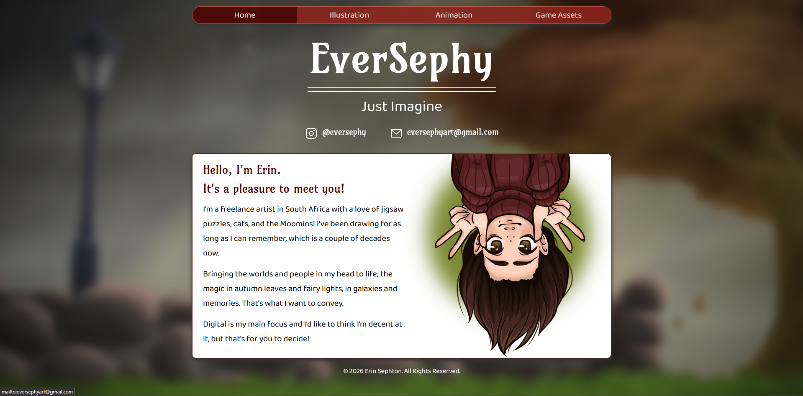

# Artist's Portfolio

## Table of Contents

- [Overview](#overview)
- [Built With](#built-with)
- [Features](#features)
<!-- - [Contact](#contact) -->
<!-- - [Acknowledgements](#acknowledgements) -->

## Overview

This is a project for a client. The client commissioned me to build them a portfolio web app. This project allows the client to showcase their artistic work to possible clients. It shows their illustrations, as well as plays their animations. 
 
The biggest challenge with this project was getting the videos to play when they needed to, and to make the loading time of the site not too long, as it has many images on it. I was able to achieve this by making the image files smaller, and

### Built With

- React.js
- HTML
- CSS
- JavaScript

## Features

- Showcases an Artist's work to possible clients
- Provides clients with relevant contact information

<!-- ## Contact -->

<!-- ## Acknowledgements -->
